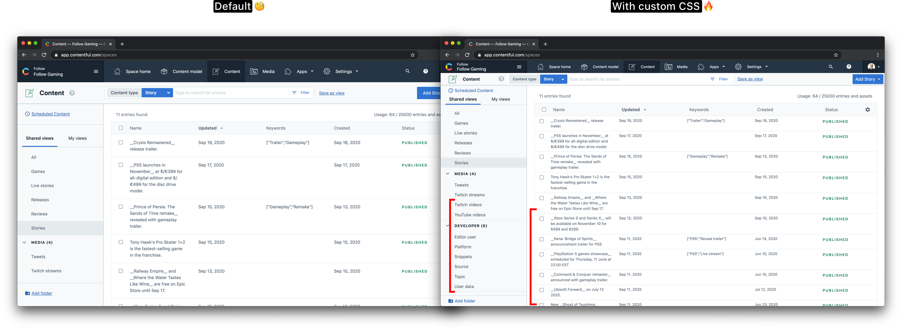
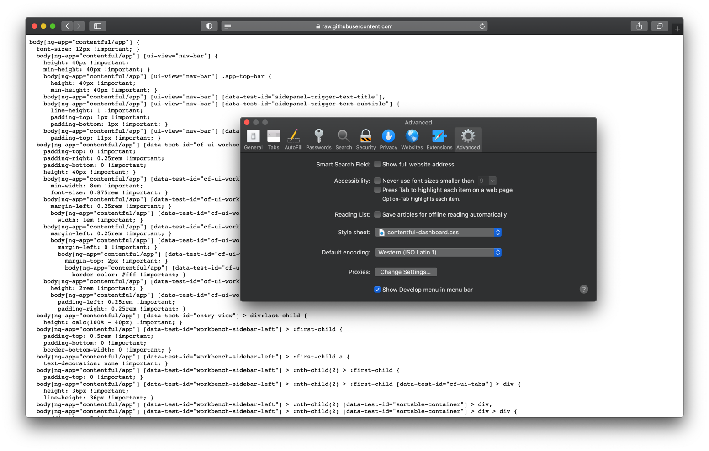

# Contentful dashboard CSS

Custom CSS to optimize the Contentful dashboard for spaces with a lot of content.

# Usage

### Chrome

1. Install the [User CSS extension](https://chrome.google.com/webstore/detail/user-css/okpjlejfhacmgjkmknjhadmkdbcldfcb?hl=en-GB) or equivalent
2. Log in to [Contentful](https://app.contentful.com)
3. Click on the extensions menu in the top right corner of your Chrome browser and select User CSS
4. Copy-paste everything from [contentful-dashboard.css](./contentful-dashboard.css) into the panel that opens up

Changes will be applied immediately. To update the custom CSS, simply repeat the process.

If the CSS isn't working, use the extension settings to make sure it's targeting the right domain (contentful.com).

### Safari

1. Open the [latest version of contentful-dashboard.css](https://raw.githubusercontent.com/jerryjappinen/contentful-dashboard-css/master/contentful-dashboard.css) 
2. Save this page as a new file anywhere on your computer
3. Open Safari
4. Open Preferences
5. Select the "Advanced" tab
6. Use the "Style sheet" dropdown to select the file you just saved

Changes will be applied immediately. To update the custom CSS to a new version, redownload the latest version and reselect it in this dropdown.
